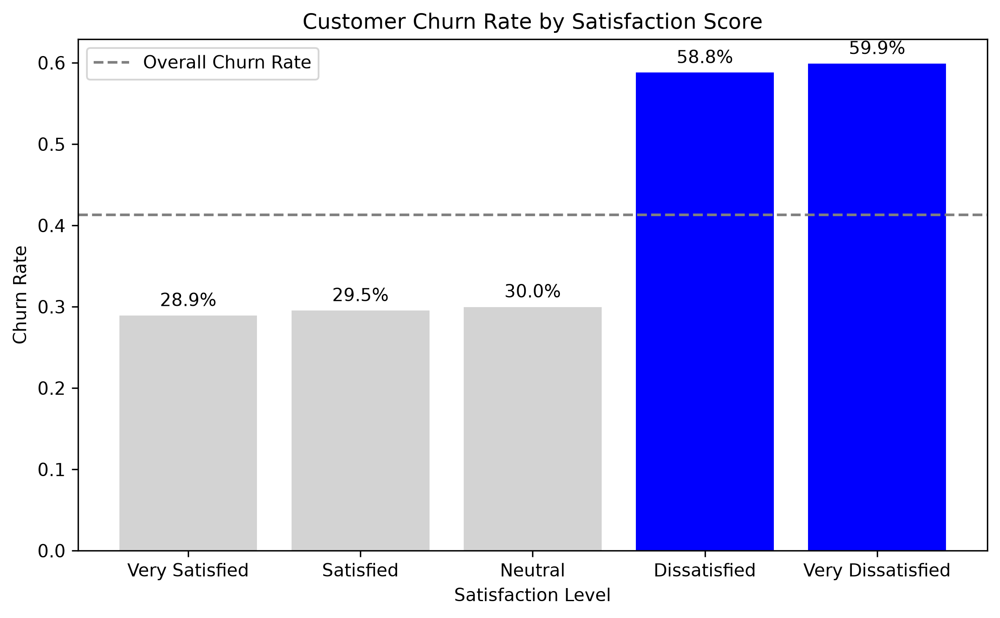
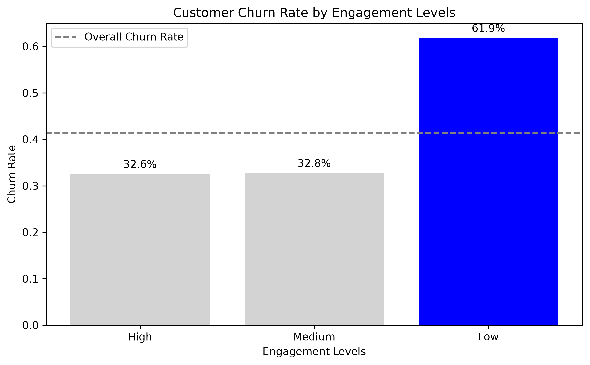
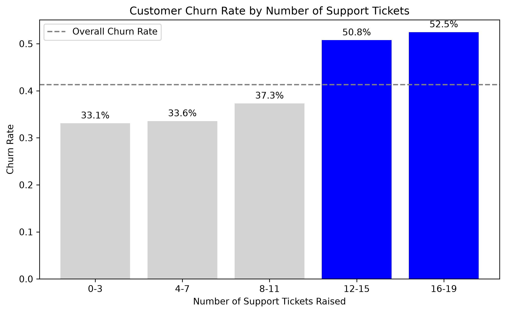
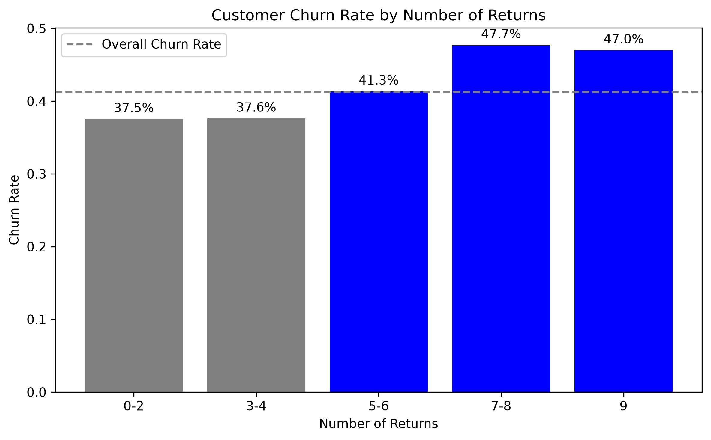
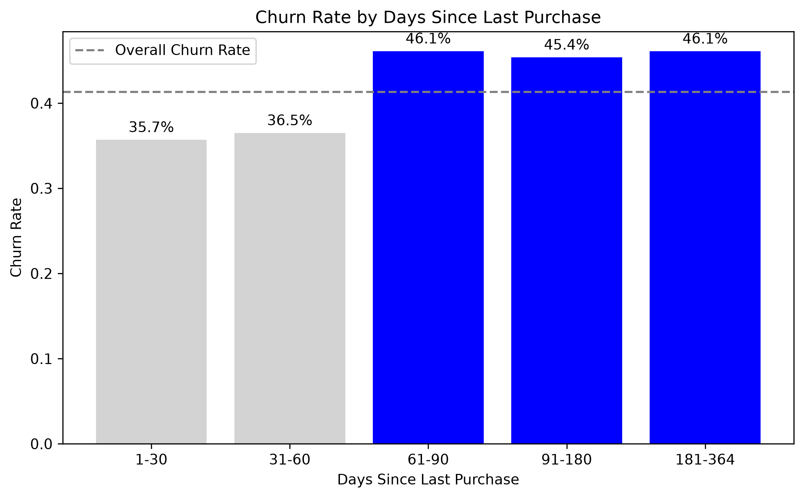
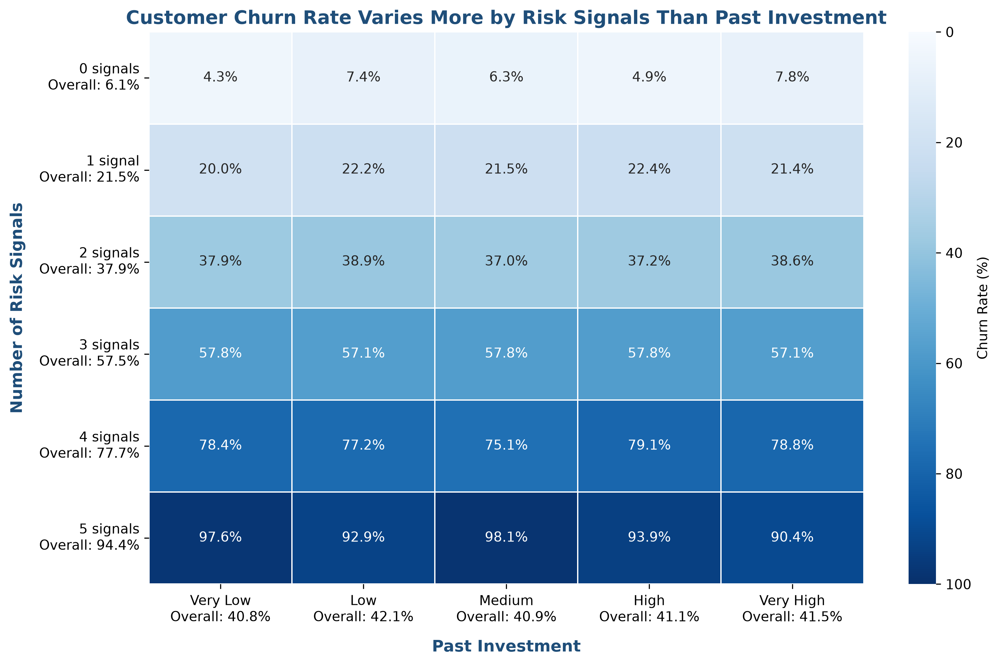

# E-Commerce Customer Churn Analysis

## Project Overview

Customer churn means that a customer leaves a business or stops purchasing. For an e-commerce company, this may reduce future repeat sales and increase the need to find new customers.

This project studies whether churn is more closely associated with:

1. **Current risk signals** related to customer experience and disengagement.
2. **Past investment** based on spending, purchases, and relationship length.

We first explore five possible risk signals separately. We then combine them into a risk-signal count and compare that count with past investment in one heatmap.

The main finding is that churn changes much more as risk signals accumulate than it does across past-investment levels. This is a descriptive analysis. It shows associations, not causes.

**Course:** Duke AIPI 510  
**Project:** Project 1 — E-Commerce Customer Churn Analysis

---

## Main Question

Does a customer's past spending and relationship history protect them from churn, or do current experience and disengagement signals show a clearer pattern?

---

## Dataset

We use the **E-Commerce Customer Churn Dataset** published by **Shair Khan (DatasciKhan)** on Kaggle.

- **Records:** 50,000
- **Columns:** 48
- **File:** `E-commerce_Customer_Churn_2026.csv`
- **License:** CC0: Public Domain
- **Source:** [Kaggle — E-Commerce Customer Churn Dataset](https://www.kaggle.com/datasets/datascikhan/e-commerce-customer-churn-2026)

The dataset includes customer profile, transaction, engagement, satisfaction, support, return, and churn information.

### Target Variable

We use `churn_flag` as the target variable:

- `0`: active or not churned
- `1`: churned

The overall churn rate in the dataset is **41.3%**.

### Data Files

| File                                           | Description                                         |
| ---------------------------------------------- | --------------------------------------------------- |
| `data/raw/E-commerce_Customer_Churn_2026.csv`  | Original dataset with 50,000 records and 48 columns |
| `data/cleaned/preprocessed_customer_churn.csv` | Output from `preprocessing.py`                      |
| `data/cleaned/customer_churn_final.csv`        | Final 18-column dataset used by `visualization.py`  |

The raw dataset has missing values in `subscription_type`, `prevention_method`, and `social_media_engagement`. These columns are not used in the final visualization dataset. The 18 selected final columns have no missing values.

---

## Analysis Design

### Five Risk Signals

The five signals summarize current experience friction and disengagement.

| Signal                | Rule                             | Interpretation                             |
| --------------------- | -------------------------------- | ------------------------------------------ |
| Low satisfaction      | `satisfaction_score <= 2`        | The customer reports a negative experience |
| Low engagement        | `engagement_level == "Low"`      | The customer has low platform activity     |
| High support activity | `support_tickets >= 12`          | The customer has repeated support needs    |
| Frequent returns      | `returns_count >= 5`             | The customer has higher return activity    |
| Purchase inactivity   | `days_since_last_purchase >= 61` | The customer has not purchased recently    |

Each condition is converted to 0 or 1. The five values are added to create `risk_signal_count`, which ranges from 0 to 5. All signals receive equal weight.

### Past Investment

Past investment uses three observed features:

- `total_spend_usd`
- `num_purchases`
- `customer_age_months` — the length of the customer relationship, not the customer's biological age

Each feature is converted to a percentile rank. The three percentiles are averaged to create `relationship_investment_score`. Customers are then divided into five equal-sized groups:

`Very Low`, `Low`, `Medium`, `High`, and `Very High`.

This measure describes past spending and relationship history. It is not future profit, customer quality, or customer lifetime value.

---

## Repository Structure

```text
510-project1/
├── README.md
├── data/
│   ├── raw/
│   │   └── E-commerce_Customer_Churn_2026.csv
│   └── cleaned/
│       ├── preprocessed_customer_churn.csv
│       └── customer_churn_final.csv
├── scripts/
│   ├── preprocessing.py
│   ├── eda.py
│   ├── feature_engineering.py
│   ├── visualization.py
│   └── visualization.ipynb
└── outputs/
    ├── 01_churn_by_satisfaction.png
    ├── 02_churn_by_engagement.png
    ├── 03_churn_by_support_tickets.png
    ├── 04_churn_by_returns.png
    ├── 05_churn_by_days_since_last_purchase.png
    └── 06_risk_signals_and_past_investment.png
```

Running `scripts/eda.py` also creates a `visualizations/` folder with additional exploratory charts. The six presentation-ready charts are saved in `outputs/` by `scripts/visualization.py`.

---

## Workflow

### 1. Preprocessing

**Script:** `scripts/preprocessing.py`

This script:

- loads the raw CSV;
- reports the shape, columns, missing values, and full-row duplicates;
- removes exact duplicate rows;
- converts `churn_flag` to numeric;
- removes records with an invalid or missing `churn_flag`; and
- saves `data/cleaned/preprocessed_customer_churn.csv`.

The script checks all missing values but does not impute the three unused columns with missing data.

### 2. Exploratory Data Analysis

**Script:** `scripts/eda.py`

This script calculates the overall churn rate and explores churn across:

- satisfaction score;
- engagement level;
- support tickets;
- support interactions;
- returns;
- days since last purchase;
- customer segment; and
- customer value category.

It prints the grouped churn rates and saves exploratory charts in `visualizations/`.

### 3. Feature Engineering

**Script:** `scripts/feature_engineering.py`

This script:

- creates `purchase_recency_group` from `days_since_last_purchase`;
- selects 18 columns used in the final analysis;
- checks the selected data; and
- saves `data/cleaned/customer_churn_final.csv`.

The chart-specific groups, five binary risk signals, risk-signal count, percentile ranks, and investment levels are created in `scripts/visualization.py`.

### 4. Final Visualization

**Script:** `scripts/visualization.py`

This script loads `customer_churn_final.csv`, creates all chart-specific features, and generates six final figures in `outputs/`.

The notebook `scripts/visualization.ipynb` shows the same analysis in an interactive EDA format. The `.py` script is the reproducible version used to generate the saved figures.

---

## How to Reproduce the Analysis

### 1. Clone the Repository

```bash
git clone https://github.com/yanliu-dev/510-project1.git
cd 510-project1
```

### 2. Create and Activate a Virtual Environment

macOS or Linux:

```bash
python3 -m venv env
source env/bin/activate
```

Windows:

```bash
python -m venv env
env\Scripts\activate
```

### 3. Install Dependencies

```bash
python -m pip install pandas matplotlib seaborn jupyter
```

### 4. Confirm the Raw Data File

The repository includes the raw dataset at:

```text
data/raw/E-commerce_Customer_Churn_2026.csv
```

If the raw file is unavailable, download it from the [Kaggle dataset page](https://www.kaggle.com/datasets/datascikhan/e-commerce-customer-churn-2026) and place it at the path above.

### 5. Run the Pipeline

Run the scripts from the repository root in this order:

```bash
python scripts/preprocessing.py
python scripts/eda.py
python scripts/feature_engineering.py
python scripts/visualization.py
```

After the last command, the six final figures will be available in `outputs/`.

### 6. Optional: Open the Notebook

```bash
jupyter notebook scripts/visualization.ipynb
```

---

## Final Visualizations

### 1. Satisfaction



### 2. Engagement



### 3. Support Tickets



### 4. Returns



### 5. Days Since Last Purchase



### 6. Risk Signals and Past Investment



---

## Key Findings

- Customers with positive or neutral satisfaction had churn rates near **29–30%**. Dissatisfied groups had churn rates near **59–60%**.
- High- and medium-engagement customers had churn rates near **33%**, while low-engagement customers reached **61.9%**.
- Churn increased to about **51–53%** in the highest support-ticket groups.
- Returns and purchase inactivity showed smaller but still visible relationships with churn.
- Overall churn increased from **6.1%** for customers with 0 risk signals to **94.4%** for customers with all 5 signals.
- Overall churn across the five past-investment groups stayed between **40.8% and 42.1%**.

The heatmap therefore shows a strong vertical pattern by risk-signal count and very little horizontal change by past investment.

---

## Limitations and Ethical Considerations

- The analysis shows association, not causation.
- The signal thresholds and equal weights were selected for this exploratory analysis. Different choices may change the results.
- The heatmap does not include confidence intervals, and some risk-signal groups contain fewer records than others.
- One public dataset may not represent every e-commerce business, country, product category, or time period.
- A churn-risk label should be used to understand and support customers, not to exclude or pressure them. Businesses should protect customer privacy and check for unfair treatment across customer groups.

---

## Collaboration and Version Control

The project uses Git and GitHub for collaboration:

1. Each contributor works on an individual branch.
2. Changes are committed with clear messages.
3. Each group member opens at least one pull request.
4. Another group member reviews the pull request.
5. Feedback is addressed before the pull request is merged into `main`.

Repository: [yanliu-dev/510-project1](https://github.com/yanliu-dev/510-project1)

---

## Citation

Khan, Shair. _E-Commerce Customer Churn Dataset_. Kaggle, 2026.  
https://www.kaggle.com/datasets/datascikhan/e-commerce-customer-churn-2026
