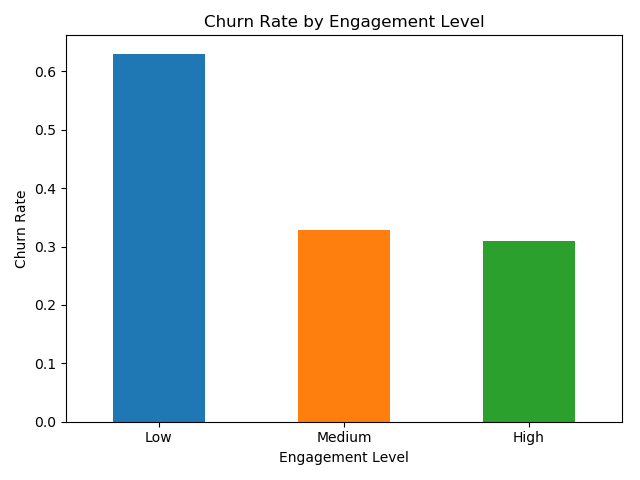
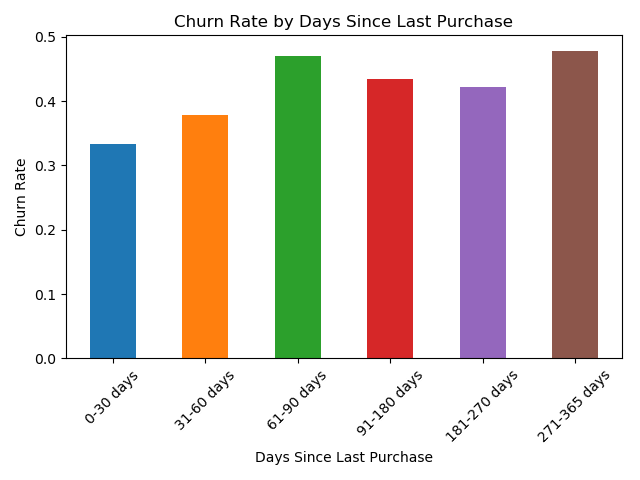
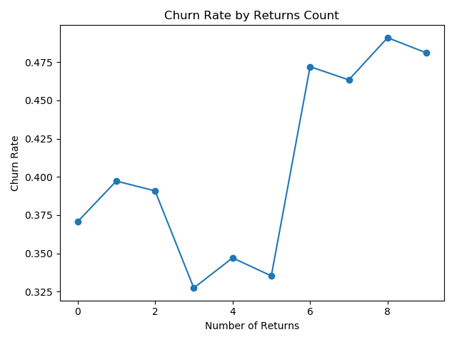
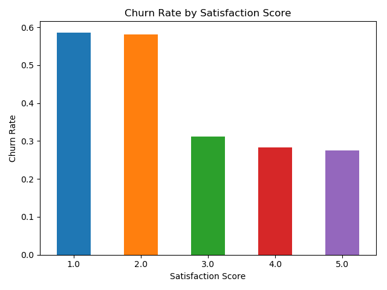
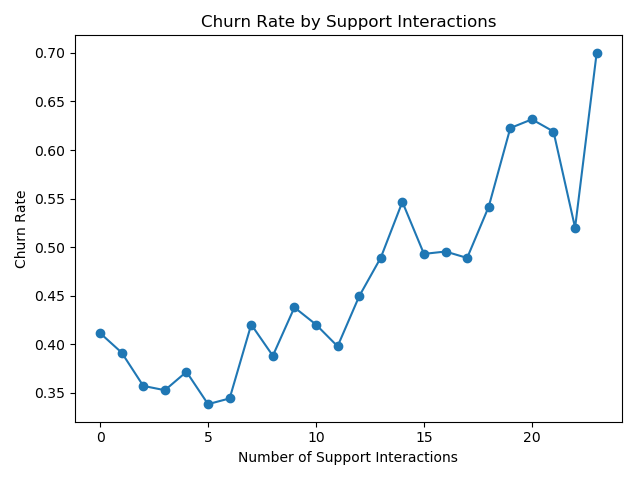
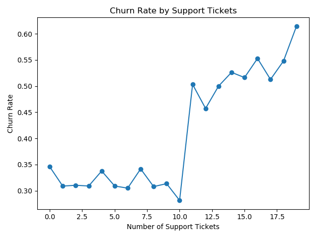

# E-Commerce Customer Churn Analysis

## Project Overview

Customer churn is an important challenge for e-commerce businesses. Understanding customer behavior and identifying patterns associated with churn can help businesses investigate customer retention opportunities and improve the customer experience.

This project analyzes e-commerce customer data to explore the relationships between customer characteristics, purchasing behavior, satisfaction, engagement, and churn.

The project follows a data analysis workflow that includes:

1. Data preprocessing and cleaning
2. Exploratory data analysis (EDA)
3. Feature engineering
4. Data visualization
5. Interpretation of findings and potential business implications

The objective is to transform raw customer data into a consistent and interpretable dataset, investigate patterns associated with churn, and communicate observations through visualizations.

**Course:** Duke AIPI 510  
**Project:** Project 1 — E-Commerce Customer Churn Analysis

---

## Research Questions

This project investigates the following questions:

1. How does customer churn vary across different customer groups?
2. How is purchasing behavior, including purchase recency and returns, associated with customer churn?
3. How do customer satisfaction and customer support interactions differ between churned and non-churned customers?
4. What relationships can be observed between customer engagement and churn?
5. What insights from the analysis could inform further investigation of customer retention?

These questions guide the exploratory analysis and visualization process. Observed associations do not necessarily indicate causal relationships.

---

## Dataset

The project uses the **E-commerce Customer Churn 2026** dataset.

### Data Files

| File | Description |
|---|---|
| `data/raw/E-commerce_Customer_Churn_2026.csv` | Original raw dataset |
| `data/cleaned/preprocessed_customer_churn.csv` | Dataset produced by the preprocessing stage |
| `data/cleaned/customer_churn_final.csv` | Final dataset prepared for downstream analysis |

The raw dataset contains customer-level information related to purchasing activity, customer experience, engagement, and churn.

### Target Variable

The primary target variable is `churn_flag`.

- `0`: Customer has not churned.
- `1`: Customer has churned.

This variable is used to distinguish churned customers from non-churned customers throughout the analysis.

### Selected Features

The analysis retains 18 selected columns covering customer characteristics, purchasing behavior, satisfaction, support activity, engagement, loyalty, and churn-related information.

These features support the project's exploratory analysis and subsequent visualizations.

---

## Repository Structure

```text
510-project1/
│
├── README.md
│
├── data/
│   ├── .DS_Store
│   │
│   ├── cleaned/
│   │   ├── customer_churn_final.csv
│   │   └── preprocessed_customer_churn.csv
│   │
│   └── raw/
│       └── E-commerce_Customer_Churn_2026.csv
│
├── scripts/
│   ├── eda.py
│   ├── feature_engineering.py
│   └── preprocessing.py
│
└── visualizations/
    ├── churn_by_engagement.png
    ├── churn_by_purchase_recency.png
    ├── churn_by_returns.png
    ├── churn_by_satisfaction.png
    ├── churn_by_support_interactions.png
    └── churn_by_support_tickets.png
```

---

## Methodology

### 1. Data Preprocessing

**Script:** `scripts/preprocessing.py`

The preprocessing stage prepares the raw customer data for analysis.

The workflow includes:

- Loading the original CSV file.
- Inspecting dataset dimensions, column names, and data types.
- Examining missing values and duplicate records.
- Checking the churn target and relevant data values.
- Standardizing inconsistent values where appropriate.
- Selecting the variables required for downstream analysis.
- Saving the preprocessed dataset.

**Output:**

`data/cleaned/preprocessed_customer_churn.csv`

The purpose of this stage is to improve data consistency while preserving usable customer records and avoiding unnecessary data loss.

### 2. Exploratory Data Analysis (EDA)

**Script:** `scripts/eda.py`

Exploratory data analysis is used to understand the structure and characteristics of the customer dataset.

The analysis investigates customer behavior and compares churn-related patterns across relevant variables, including:

- Customer engagement
- Purchase recency
- Product returns
- Customer satisfaction
- Customer support interactions
- Customer support tickets

Descriptive statistics and visualizations help identify patterns, differences between customer groups, and potential directions for further investigation.

### 3. Feature Engineering

**Script:** `scripts/feature_engineering.py`

The feature engineering stage prepares the processed customer data for downstream analysis.

This stage works with the preprocessed dataset and produces the final analysis dataset.

**Output:**

`data/cleaned/customer_churn_final.csv`

The final dataset provides a consistent set of selected variables for subsequent analysis and visualization.

### 4. Data Visualization

The project includes six visualizations examining churn in relation to customer behavior and experience.

The charts are stored in the `visualizations/` directory.

| Visualization | Analytical Focus |
|---|---|
| `churn_by_engagement.png` | Customer engagement and churn |
| `churn_by_purchase_recency.png` | Purchase recency and churn |
| `churn_by_returns.png` | Product returns and churn |
| `churn_by_satisfaction.png` | Customer satisfaction and churn |
| `churn_by_support_interactions.png` | Support interactions and churn |
| `churn_by_support_tickets.png` | Support tickets and churn |

---

## Visualizations

### Customer Engagement and Churn



### Purchase Recency and Churn



### Product Returns and Churn



### Customer Satisfaction and Churn



### Customer Support Interactions and Churn



### Customer Support Tickets and Churn



---

## Tools and Technologies

The project uses the following tools and technologies:

- **Python** — data processing and analysis
- **Pandas** — data loading, cleaning, transformation, and aggregation
- **NumPy** — numerical operations
- **Matplotlib** — data visualization
- **Seaborn** — statistical visualization, where used
- **Git and GitHub** — version control and collaborative development

---

## Getting Started

### Prerequisites

- Python 3
- pip
- The project repository and its raw CSV dataset

### Step 1: Clone the Repository

```bash
git clone https://github.com/yanliu-dev/510-project1.git
cd 510-project1
```

### Step 2: Install Dependencies

Install the core data analysis and visualization packages:

```bash
python -m pip install pandas numpy matplotlib seaborn
```

If additional packages are imported by the scripts, install them before running the corresponding script.

### Step 3: Run Data Preprocessing

```bash
python scripts/preprocessing.py
```

This step loads and preprocesses the raw dataset and saves the resulting preprocessed data.

### Step 4: Run Exploratory Data Analysis

```bash
python scripts/eda.py
```

This step performs exploratory analysis using the available customer data.

### Step 5: Run Feature Engineering

```bash
python scripts/feature_engineering.py
```

This step generates the final analysis dataset.

**Execution note:** These commands assume that the scripts use the repository-relative input and output paths described in this README. Make sure the expected input files are available before running each script.

---

## Results and Interpretation

The project's analysis focuses on the relationships between churn and:

- Customer engagement
- Purchase recency
- Product returns
- Customer satisfaction
- Customer support interactions
- Customer support tickets

The visualizations provide a basis for examining differences between churned and non-churned customers.

The interpretation of the results should consider:

- Whether differences between customer groups are substantial.
- Whether observed patterns are consistent across relevant variables.
- Whether findings may be affected by missing data, data quality, or preprocessing decisions.
- Whether additional statistical analysis or predictive modeling is needed to validate the observations.

Specific findings and business recommendations should be based on the actual analysis outputs and chart values.

---

## Limitations

Several limitations should be considered when interpreting the results:

- The analysis is limited to the information available in the supplied dataset.
- Observational relationships do not establish causation.
- Data cleaning and feature selection decisions may influence the findings.
- Patterns identified in this dataset may not generalize to other e-commerce businesses or customer populations.
- Additional validation is needed before using the findings to guide operational decisions.

---

## Future Work

Potential extensions of this project include:

- Investigating additional factors associated with customer churn.
- Exploring customer segmentation and retention patterns in greater detail.
- Developing and evaluating predictive churn models.
- Comparing model performance across customer segments.
- Testing potential retention strategies and measuring their effectiveness.

---

## Collaboration and Version Control

The project is maintained using Git and GitHub.

The collaborative workflow includes:

1. Creating individual branches for development.
2. Making and testing changes locally.
3. Committing and pushing changes to GitHub.
4. Opening pull requests for code review.
5. Incorporating reviewer feedback and resolving conflicts.
6. Merging reviewed contributions into the appropriate branch.

This workflow supports transparent collaboration and helps maintain a traceable history of project changes.

---

## Acknowledgments

This project was developed as part of Duke AIPI 510.

We acknowledge the course instructors, collaborators, and dataset provider for the resources and contributions supporting this project.

---

## Project Information

- **Course:** Duke AIPI 510
- **Project:** Project 1 — E-Commerce Customer Churn Analysis
- **Repository:** [yanliu-dev/510-project1](https://github.com/yanliu-dev/510-project1)
